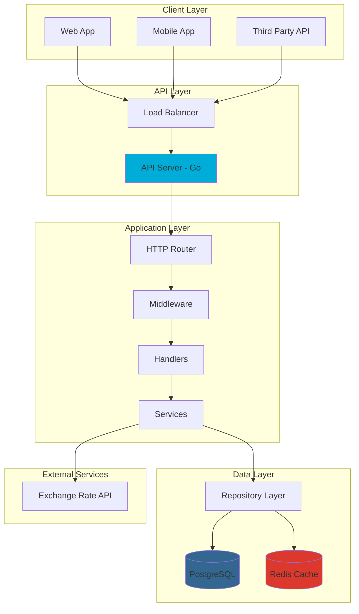
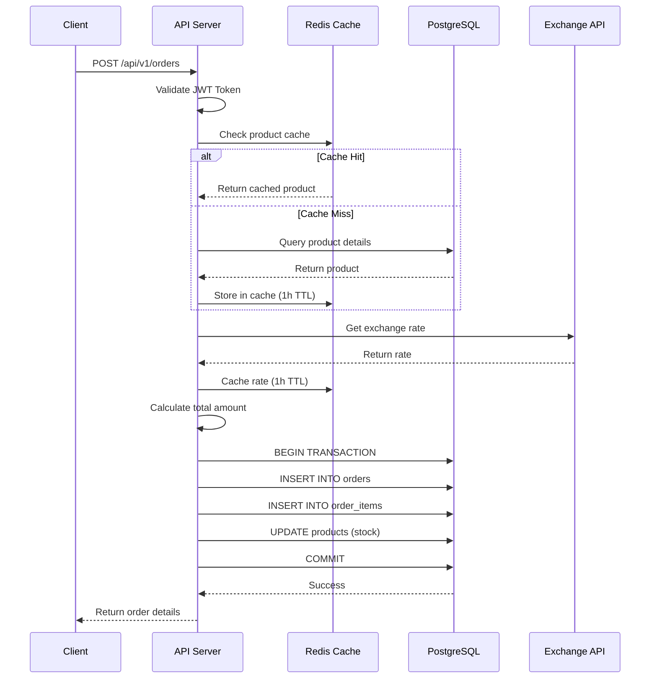
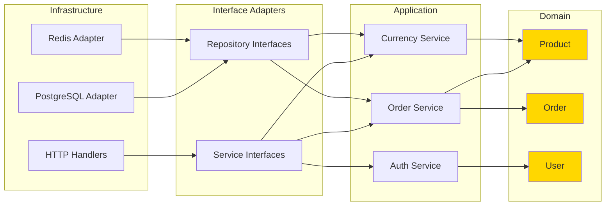
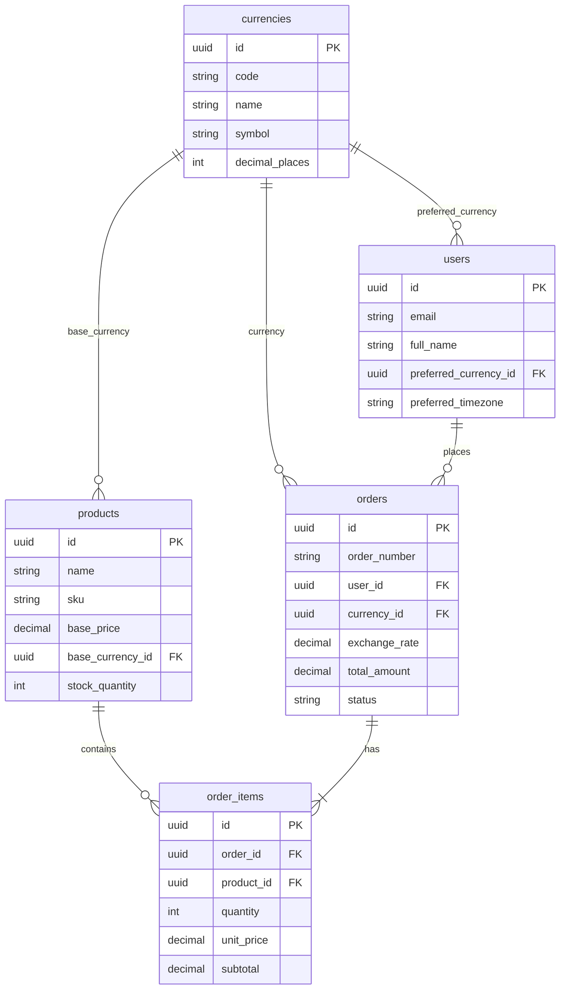
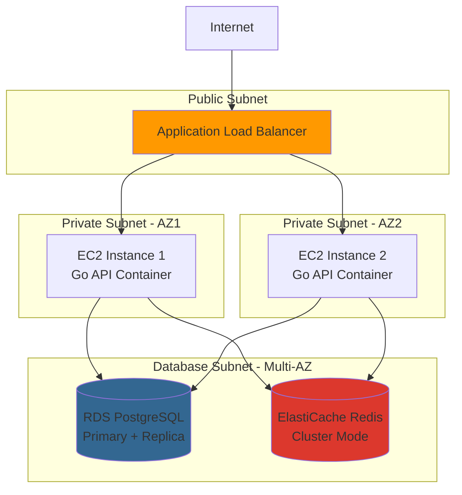

# Architecture Diagram (Mermaid)

## System Architecture

```mermaid
graph TB
    subgraph "Client Layer"
        A1[Web App]
        A2[Mobile App]
        A3[Third Party API]
    end

    subgraph "API Layer"
        B1[Load Balancer]
        B2[API Server - Go]
    end

    subgraph "Application Layer"
        C1[HTTP Router]
        C2[Middleware]
        C3[Handlers]
        C4[Services]
    end

    subgraph "Data Layer"
        D1[Repository Layer]
        D2[(PostgreSQL)]
        D3[(Redis Cache)]
    end

    subgraph "External Services"
        E1[Exchange Rate API]
    end

    A1 & A2 & A3 --> B1
    B1 --> B2
    B2 --> C1
    C1 --> C2
    C2 --> C3
    C3 --> C4
    C4 --> D1
    D1 --> D2
    D1 --> D3
    C4 --> E1

    style B2 fill:#00ADD8
    style D2 fill:#336791
    style D3 fill:#DC382D
```

## Order Creation Flow

```mermaid
sequenceDiagram
    participant C as Client
    participant A as API Server
    participant R as Redis Cache
    participant P as PostgreSQL
    participant E as Exchange API

    C->>A: POST /api/v1/orders
    A->>A: Validate JWT Token
    A->>R: Check product cache
    alt Cache Hit
        R-->>A: Return cached product
    else Cache Miss
        A->>P: Query product details
        P-->>A: Return product
        A->>R: Store in cache (1h TTL)
    end
    
    A->>E: Get exchange rate
    E-->>A: Return rate
    A->>R: Cache rate (1h TTL)
    
    A->>A: Calculate total amount
    A->>P: BEGIN TRANSACTION
    A->>P: INSERT INTO orders
    A->>P: INSERT INTO order_items
    A->>P: UPDATE products (stock)
    A->>P: COMMIT
    P-->>A: Success
    A-->>C: Return order details
```

## Clean Architecture Layers

```mermaid
graph LR
    subgraph "Infrastructure"
        I1[HTTP Handlers]
        I2[PostgreSQL Adapter]
        I3[Redis Adapter]
    end

    subgraph "Interface Adapters"
        IA1[Repository Interfaces]
        IA2[Service Interfaces]
    end

    subgraph "Application"
        AP1[Order Service]
        AP2[Currency Service]
        AP3[Auth Service]
    end

    subgraph "Domain"
        D1[Product]
        D2[Order]
        D3[User]
    end

    I1 --> IA2
    I2 --> IA1
    I3 --> IA1
    IA2 --> AP1
    IA2 --> AP2
    IA2 --> AP3
    IA1 --> AP1
    IA1 --> AP2
    AP1 --> D1
    AP1 --> D2
    AP2 --> D1
    AP3 --> D3

    style D1 fill:#FFD700
    style D2 fill:#FFD700
    style D3 fill:#FFD700
```

## Database Schema Relationships

```mermaid
erDiagram
    currencies ||--o{ products : "base_currency"
    currencies ||--o{ users : "preferred_currency"
    currencies ||--o{ orders : "currency"
    
    users ||--o{ orders : "places"
    
    products ||--o{ order_items : "contains"
    
    orders ||--|{ order_items : "has"
    
    currencies {
        uuid id PK
        string code
        string name
        string symbol
        int decimal_places
    }
    
    users {
        uuid id PK
        string email
        string full_name
        uuid preferred_currency_id FK
        string preferred_timezone
    }
    
    products {
        uuid id PK
        string name
        string sku
        decimal base_price
        uuid base_currency_id FK
        int stock_quantity
    }
    
    orders {
        uuid id PK
        string order_number
        uuid user_id FK
        uuid currency_id FK
        decimal exchange_rate
        decimal total_amount
        string status
    }
    
    order_items {
        uuid id PK
        uuid order_id FK
        uuid product_id FK
        int quantity
        decimal unit_price
        decimal subtotal
    }
```

## Deployment Architecture (AWS)

```mermaid
graph TB
    subgraph "Public Subnet"
        ALB[Application Load Balancer]
    end

    subgraph "Private Subnet - AZ1"
        EC2_1[EC2 Instance 1<br/>Go API Container]
    end

    subgraph "Private Subnet - AZ2"
        EC2_2[EC2 Instance 2<br/>Go API Container]
    end

    subgraph "Database Subnet - Multi-AZ"
        RDS[(RDS PostgreSQL<br/>Primary + Replica)]
        REDIS[(ElastiCache Redis<br/>Cluster Mode)]
    end

    Internet[Internet] --> ALB
    ALB --> EC2_1
    ALB --> EC2_2
    EC2_1 --> RDS
    EC2_1 --> REDIS
    EC2_2 --> RDS
    EC2_2 --> REDIS

    style ALB fill:#FF9900
    style RDS fill:#336791
    style REDIS fill:#DC382D
```
